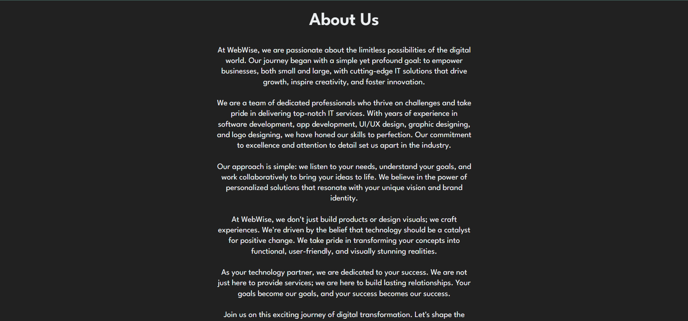
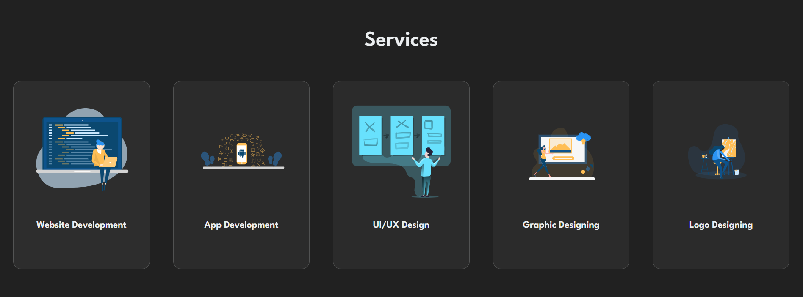
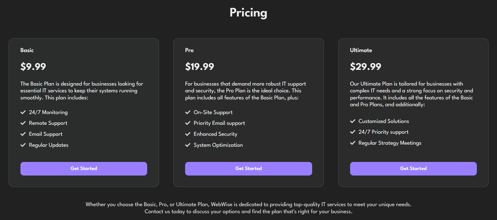

# PRODIGY_WD_01 - Landing Page

Welcome to the README for the **WebWise Landing Page** which is the Task-1 of my Web Development Internship at Prodigy Infotech. This document will help you understand the key features of the project.

## Introduction

A simple landing page for **WebWise**, showcasing their About Us, Services, Pricing and Contact button.

## Table of Contents

- [Demo-Screenshots](#demo)
- [Features](#features)
- [Technologies Used](#technologies-used)
- [Getting Started](#getting-started)

## Demo

Live github-website is here: [WebWise](https://dilkhan-1.github.io/PRODIGY_WD_01/){:target="_blank"}
Screenshots of the **WebWise** landing page are following: 







## Features

- **About Us Section:** Provides a brief overview of WebWise.
- **Services Section:** Highlights the services offered by WebWise.
- **Pricing Section:** Displays the pricing plans.
- **Contact Us Button:** Easily allows users to get in touch with WebWise.

## Technologies Used

The technologies I used to build the landing page:

- HTML
- CSS
- JavaScript

## Getting Started

1. Clone the repository to your local machine:
```bash
git clone https://github.com/Dilkhan-1/PRODIGY_WD_01.git
```

2. Open the project folder.
```bash
cd PRODIGY_WD_01
```

3. Run `index.html` in your preferred web browser.
